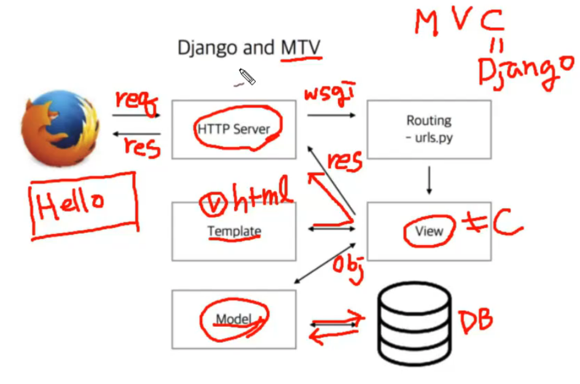

# Django로 

## Django와 MTV
Model Template View 의 MVC   
Model View Controller 의 MVC 의 C가 Django 다.   
View가 모델로 부터 데이터를 가져오거나   
Template 가 디자인 요소   
ORM - Object Relation Model, 데이터베이스

### url 과 views
- Django 2.0 이전엔 django.conf.urls의 url로 라우팅했다.    
- 정규식 때문에 복잡했기 때문에 2.0 부터 path라는 간결한 모듈이 나왔다.   
- r'^$' -> '' 가 루트 url

### model 
- 모델 안에서 인퍼런스 
- 레디스와의 연동 하는 경우를 고려
~~~sh
python manage.py makemigrations
python manage.py migrate 
~~~
### Admin
- amore / amore12345 ( createsuperuser )
- 모델 클래스 연동하기

### Test
- tests.py를 작성한 후 python manage.py test  

### ORM
오브젝트와 DB를 연결하여 DB의 CRUD를 쉽게 할 수 있게 한다

## shortcut
많이 쓰는 형식을 미리 만들어 놓았음
- get_object_or_404
- get_list_of_404 

## Function Base Method
- if-else로 http method로 처리해야한다.
## Class Base Method
- 코드가 가독성이 좋아진다.
- 클래스를 적어준다. 
- get, post를 http method로 별도의 파이썬 메소드로 처리할 수 있다.
- 복잡한 구현이 가능해진다. / generic view - detail view